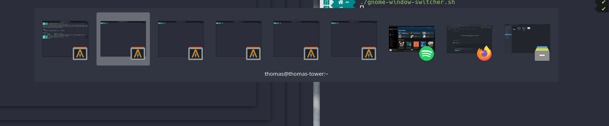
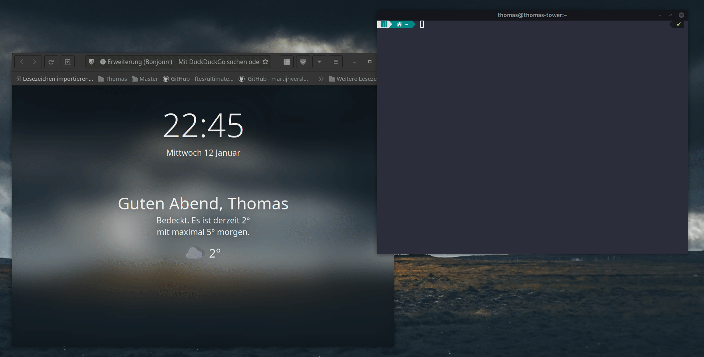

# gnome-window-switcher
change the standard alt-tab behaviour to known one from Mac or Windows



## Usage
Put the `gnome-window-switcher.sh` file anywhere and make it executable with:
```
chmod +x ./gnome-window-switcher.sh
```
Execute the file with:
```
./gnome-window-switcher.sh
```

## Example GIF

